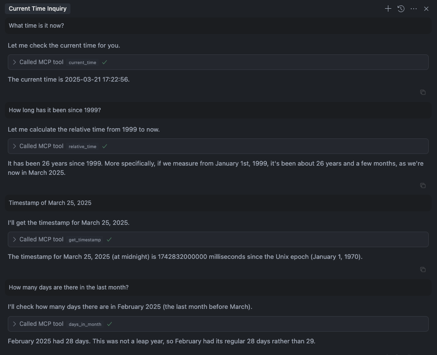

# 🚀 Time MCP Server: Advanced Time Awareness with Chinese Holidays

[](https://smithery.ai/server/@yokingma/time-mcp) <a href="https://github.com/yokingma/time-mcp/stargazers"></a> <a href="https://github.com/yokingma/time-mcp/blob/main/LICENSE"></a> <a href="https://github.com/yokingma/time-mcp/issues/new"></a>

A powerful Model Context Protocol (MCP) server that provides LLMs with comprehensive time awareness capabilities, including **Chinese holiday support** and **offline caching**.

<div align="center">
 
</div>

## ✨ Key Features

- 🕒 **14 Time Tools**: Comprehensive time manipulation and query capabilities
- 🇨🇳 **Chinese Holidays**: Integrated 2004-2025 Chinese holiday data with workday adjustments
- 📊 **Multi-dimensional Queries**: Workdays by week, month, quarter, year, and custom ranges
- 🔄 **Offline Caching**: Automatic data synchronization with graceful degradation
- 🎯 **Flexible Configuration**: Custom workdays, holidays, and regional settings
- 🛡️ **Type Safe**: Full TypeScript support with strict parameter validation
- 📱 **Universal**: Works with Claude Desktop, Cursor, Windsurf, Cherry Studio

## 🛠️ Available Tools

### Basic Time Tools (6)

- `current_time` - Get current time (UTC and local time)
- `relative_time` - Get relative time from now
- `get_timestamp` - Get timestamp for specific time
- `days_in_month` - Get number of days in a month
- `convert_time` - Convert time between timezones
- `get_week_year` - Get week and ISO week numbers

### Advanced Workday Tools (5)

- `get_workdays_by_week` - Get workdays by ISO week and year
- `get_workdays_by_month` - Get workdays for a specific month
- `get_workdays_by_range` - Get workdays for custom date ranges
- `get_workdays_by_quarter` - Get workdays for a specific quarter
- `get_workdays_by_year` - Get workdays for an entire year

### Utility Tools (3)

- `get_week_dates` - Get date range for ISO weeks
- `get_iso_weeks_in_month` - Get ISO weeks contained in a month
- `get_workday_stats` - Get workday statistics and analysis

## 🚀 Quick Start

### 1. Install via Smithery (Recommended)

```bash
npx -y @smithery/cli install @yokingma/time-mcp --client claude
```

### 2. Manual Installation

```bash
# Install globally
npm install -g time-mcp

# Or use with npx (no installation needed)
npx -y time-mcp
```

### 3. Local Development

```bash
# Clone and setup
git clone https://github.com/yokingma/time-mcp.git
cd time-mcp
pnpm install
pnpm run build
```

## ⚙️ Configuration

### Claude Desktop

```json
{
  "mcpServers": {
    "time-mcp": {
      "command": "npx",
      "args": ["-y", "time-mcp"]
    }
  }
}
```

### Cursor (mcp.json)

```json
{
  "mcpServers": {
    "time-mcp": {
      "command": "npx",
      "args": ["-y", "time-mcp"]
    }
  }
}
```

### Windsurf

```json
{
  "mcpServers": {
    "time-mcp": {
      "command": "npx",
      "args": ["-y", "time-mcp"]
    }
  }
}
```

### Cherry Studio (Local Build)

```json
{
  "mcpServers": {
    "time-mcp": {
      "command": "node",
      "args": ["E:/Workspace/mcp-servers/time-mcp/dist/index.js"]
    }
  }
}
```

## 📋 Usage Examples

### Basic Time Queries

```bash
# Get current time
current_time(format: "YYYY-MM-DD HH:mm:ss", timezone: "Asia/Shanghai")

# Convert time between timezones
convert_time(sourceTimezone: "UTC", targetTimezone: "Asia/Shanghai", time: "2025-03-17 12:00:00")
```

### Workday Queries with Chinese Holidays

```bash
# Get workdays for March 2025 (Chinese region)
get_workdays_by_month(year: 2025, month: 3, region: "china")

# Get workdays for Q1 2025
get_workdays_by_quarter(year: 2025, quarter: 1, region: "china")

# Get workdays for custom date range
get_workdays_by_range(startDate: "2025-03-01", endDate: "2025-03-31", region: "china")

# Get workday statistics
get_workday_stats(startDate: "2025-01-01", endDate: "2025-12-31", region: "china")
```

### Custom Configuration

```bash
# Custom workdays and holidays
get_workdays_by_month(
  year: 2025,
  month: 3,
  region: "china",
  customWorkdays: ["2025-03-08"],  // Override holiday
  customHolidays: ["2025-03-15"]   // Custom holiday
)
```

## 🌟 Advanced Features

### Chinese Holiday Integration

- **Automatic Data Download**: Holiday data downloaded on first installation
- **Offline Caching**: Works without internet connection using cached data
- **Daily Sync**: Automatic data updates at 24:00
- **Smart Fallback**: Graceful degradation when network is unavailable
- **Historical Data**: 2004-2025 Chinese holidays, workdays, and in-lieu days

### Flexible Workday Queries

- **Multiple Dimensions**: Week, month, quarter, year, and custom ranges
- **Regional Support**: Chinese holidays vs standard Monday-Friday
- **Custom Overrides**: Define custom workdays and holidays
- **Real-time Refresh**: Manually refresh holiday data when needed
- **Comprehensive Stats**: Detailed workday analysis and reporting

### Developer Experience

- **Full TypeScript**: Complete type safety and IntelliSense
- **Parameter Validation**: Strict input validation with helpful error messages
- **Comprehensive Testing**: 65+ unit tests with 100% coverage
- **Modern Toolchain**: Vitest, tsup, ESLint with latest standards

## 🏗️ Development

```bash
# Development
pnpm run dev          # Start development server
pnpm run build        # Build for production
pnpm run lint         # Check code quality
pnpm run lint:fix     # Fix linting issues

# Testing
pnpm test             # Run all tests
pnpm test:coverage    # Generate coverage report
pnpm test:watch       # Watch mode for development
```

## 📊 Project Stats

- **Tools**: 14 comprehensive time and workday tools
- **Code Coverage**: 100% with 65+ test cases
- **Bundle Size**: ~58KB (ESM), ~61KB (CJS)
- **Holiday Data**: 35KB (2004-2025 Chinese holidays)
- **Dependencies**: Minimal, production-ready

## 🔧 System Requirements

- **Node.js**: >= 20.0.0
- **Memory**: ~50MB runtime memory
- **Storage**: ~5MB (including cached holiday data)
- **Network**: Optional (for holiday data updates)

## 🤝 Contributing

1. Fork the repository
2. Create a feature branch (`git checkout -b feature/amazing-feature`)
3. Commit your changes (`git commit -m 'Add amazing feature'`)
4. Push to the branch (`git push origin feature/amazing-feature`)
5. Open a Pull Request

## 📄 License

MIT License - see [LICENSE](./LICENSE) file for details.

## 🙏 Acknowledgments

- [Model Context Protocol](https://github.com/modelcontextprotocol/) for the MCP framework
- [Chinese Days](https://github.com/LofeeL/chinese-days) for Chinese holiday data
- [Day.js](https://day.js.org/) for powerful date manipulation

---

<div align="center">
  <strong>Time MCP Server</strong> - Giving LLMs comprehensive time awareness capabilities
</div>
